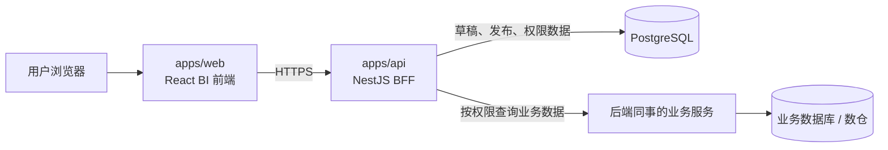

# Nest BFF 架构规划

> 本文描述项目后续的目标架构，不代表所有能力已经实现。当前已实现的 Dashboard 草稿、发布快照和数据集示例接口，以 `00-roadmap.md` 与 `apps/api` 代码为准。

## 1. 定位

`apps/api` 中的 NestJS 服务定位为 BI 看板的 **BFF（Backend For Frontend，面向前端的后端）**。

它为 `apps/web` 提供统一的应用接口，承担登录态、访问控制、看板持久化、发布及业务数据编排；它不替代已有业务系统，也不应成为业务事实数据的主存储。



## 2. BFF 的职责边界

| 能力 | Nest BFF 负责什么 | 不负责什么 |
| --- | --- | --- |
| 鉴权 | 登录、身份凭证校验、当前用户识别、退出登录 | 直接管理其他业务系统的账号实现 |
| 会话 | 签发和校验 Cookie 或 Token、续期、失效、会话安全策略 | 在前端长期保存敏感凭证 |
| 权限 | 判断用户是否能查看、编辑、发布、管理某个看板或数据集 | 以“前端按钮隐藏”代替服务端校验 |
| 看板保存 | 持久化草稿、组件配置、布局、数据绑定及筛选条件 | 保存业务订单、客户、库存等事实数据 |
| 看板发布 | 将合法草稿生成稳定的已发布快照，并提供只读访问 | 让未发布的编辑自动影响线上看板 |
| 业务数据接入 | 调用业务服务接口、透传必要身份上下文、校验和裁剪结果、适配为图表所需结构 | 复制并长期维护全量业务明细数据 |

## 3. 身份、会话与权限

三者在服务端的处理顺序如下：

1. **鉴权（Authentication）**：用户登录后，Nest BFF 验证身份并得到用户 ID、组织/租户等身份信息。
2. **会话（Session）**：BFF 用安全的 HttpOnly Cookie 或短期 Access Token 保持登录状态；每次请求先恢复当前用户。
3. **权限（Authorization）**：路由与 Service 根据用户、角色和看板协作者关系，判断当前操作是否允许。

推荐先覆盖以下动作权限：

| 资源 | 动作 | 示例角色 |
| --- | --- | --- |
| 看板 | `view` | 查看者、编辑者、所有者 |
| 看板 | `edit` | 编辑者、所有者 |
| 看板 | `publish` | 发布者、所有者 |
| 看板 | `manage` | 所有者、管理员 |
| 数据集 | `use` | 被授权的看板用户 |
| 数据源连接 | `manage` | 管理员 |

权限校验必须在 Nest BFF 内完成；前端仅用于呈现当前用户可见的入口，不能作为安全边界。

## 4. 看板草稿与发布模型

Nest BFF 保存 BI 元数据，而不是业务事实数据。

建议持久化以下信息：

- 看板基本信息：名称、描述、所属组织、创建者、更新时间。
- 草稿：页面、组件、网格布局、图表样式、字段绑定、筛选与参数配置。
- 发布版本：发布时生成的不可变快照、版本号、发布时间、发布人。
- 协作者和权限：看板与用户/角色的关系及允许的动作。
- 数据集引用：数据集标识、可用字段约束与访问范围；不保存全量查询结果。

操作流程：

```text
编辑器修改草稿 → BFF 校验当前用户 edit 权限 → 保存草稿
                         ↓
点击发布 → BFF 校验 publish 权限 → 校验草稿 → 生成发布快照
                         ↓
查看已发布看板 → BFF 读取发布快照并按用户权限返回数据
```

草稿与发布快照必须分离：保存草稿不会改变线上已发布看板；只有成功发布才会替换当前可见的发布版本。

## 5. 业务数据接入方式

业务订单、销售额、客户、库存等数据继续由后端同事维护的业务服务或数仓负责。前端不直接调用这些服务，而是通过 BFF 访问：

```text
图表请求数据
  → Nest BFF 校验会话、看板权限和数据集 use 权限
  → 将图表绑定、筛选条件转换为允许的业务查询参数
  → 调用业务服务接口
  → 校验、脱敏、裁剪并转换为统一 DatasetQueryResult
  → 返回给图表渲染器
```

接入时需要遵守：

- 只接入明确允许的数据集、字段、指标和筛选参数，禁止前端传任意 SQL 或任意业务 URL。
- BFF 应设置超时、重试边界、错误码转换和调用日志；上游异常不能直接泄露内部实现。
- 如业务服务需要用户身份或数据范围，BFF 传递经过约束的用户/组织上下文，不能仅使用前端传入的用户 ID。
- 对高频、昂贵的聚合查询可加入短期缓存；缓存键需包含组织、权限范围和查询参数，避免跨权限泄露数据。

## 6. 推荐 Nest 模块划分

| 模块 | 建议职责 |
| --- | --- |
| `auth` | 登录、登出、身份提供方对接、Access Token/Cookie 校验 |
| `session` | 会话创建、续期、撤销、设备或会话记录（按选型决定是否与 auth 合并） |
| `access-control` | 角色、协作者、资源级权限守卫与策略 |
| `dashboards` | 草稿 CRUD、revision 乐观锁、看板元数据 |
| `publishing` | 发布校验、发布快照、版本读取 |
| `datasets` | 数据集目录、schema、统一 query DTO、结果校验 |
| `upstream-connectors` | 调用后端同事业务接口的适配器、超时、错误转换和观测 |
| `prisma` | PostgreSQL 持久化访问及事务支持 |

其中 Controller 只处理 HTTP 输入输出；权限和业务规则放在 Guard/Service；业务服务调用通过 connector/repository 抽象，避免图表或 Controller 直接依赖某位同事的接口实现。

## 7. API 形态建议

现有看板与数据集接口可逐步加入登录态和权限保护：

| 场景 | 建议接口 | 关键保护 |
| --- | --- | --- |
| 获取当前用户 | `GET /me` | 有效会话 |
| 登录/退出 | `POST /auth/login`、`POST /auth/logout` | 凭证校验、限流、Cookie/Token 策略 |
| 看板草稿 | `POST/GET/PUT /dashboards...` | `view` / `edit` 权限 |
| 发布与已发布读取 | `POST /dashboards/:id/publish`、`GET /published-dashboards/:id` | `publish` / `view` 权限 |
| 图表数据查询 | `GET /datasets`、`GET /datasets/:id/schema`、`POST /datasets/:id/query` | 数据集 `use` 权限与参数白名单 |

公开分享若后续需要，应单独设计只读分享令牌或公开链接，不应绕过常规鉴权后直接暴露草稿和数据集接口。

## 8. 实施顺序

1. 先完成现有 Dashboard 草稿、发布快照和固定数据集网关的稳定化。
2. 接入身份来源，新增当前用户、登录态和统一 Auth Guard。
3. 为看板和数据集建立资源级权限模型，并给现有接口补上权限校验。
4. 将固定数据集 repository 替换或扩展为业务服务 connector，先接一个真实、低风险的数据集完成联调。
5. 再加入审计日志、发布历史/回滚、缓存和更多数据源。

## 9. 关键决策

- Nest BFF 是前端唯一的应用 API 入口；浏览器不直接携带业务系统凭证调用内部业务接口。
- PostgreSQL 存 BI 元数据、权限关系和会话相关数据；业务服务或数仓保留事实数据主权。
- 所有保存、发布、查询都必须以服务端权限校验为准。
- 图表组件只依赖统一的数据集契约，不感知具体业务服务的接口差异。
