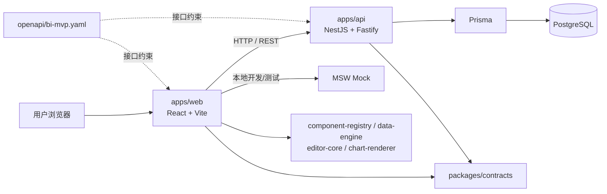

# Drag Visual BI 看板技术文档

> 本文以当前仓库代码为准，说明前端、后端、共享包及基础设施的职责边界。业务代码应优先修改 `src/`；`dist/` 与 `src/generated/prisma/` 均为构建或代码生成产物，不应手工修改。

## 1. 技术总览

| 层级 | 主要技术 | 职责 |
| --- | --- | --- |
| Web 前端 | React 19、Vite、TypeScript、Ant Design、React Router | 看板列表、编辑器、预览、公开查看页、数据绑定和图表交互 |
| API 后端 | NestJS 11、Fastify、Zod | 提供看板草稿、发布快照、数据集查询和健康检查接口 |
| 数据库 | PostgreSQL 16、Prisma 7 | 持久化看板草稿与已发布快照 |
| 共享领域包 | Zod、TypeScript | 统一看板/数据集结构、迁移规则、组件定义、编辑器状态和图表渲染 |
| 接口契约 | OpenAPI 3.1、Redocly | 约束前后端接口路径、请求响应、错误码及样例 |
| 测试 | Vitest、Testing Library、MSW、Playwright | 单元测试、前端接口模拟和浏览器端到端验证 |



## 2. 仓库目录与运行方式

| 路径 | 职责 |
| --- | --- |
| `apps/web` | 浏览器端单页应用 |
| `apps/api` | 服务端 REST API |
| `packages/*` | 可被前、后端复用的纯 TypeScript 领域能力 |
| `prisma` | 数据库 schema 与迁移历史 |
| `openapi/bi-mvp.yaml` | 静态接口契约与接口样例 |
| `compose.yaml` | 本地 PostgreSQL 容器定义 |
| `e2e` | Playwright 端到端用例 |
| `docs` | 架构、开发与发布文档 |
| `outputs` | 图表导入用的样例数据与验证产物；不参与应用运行 |

常用命令：

```bash
# 启动 PostgreSQL
pnpm db:up

# 同时启动 Web 和 API（Web: 5173，API: 3000）
pnpm dev

# 仅启动 Web；需要 API 已启动，或通过 VITE_API_BASE_URL 配置地址
pnpm dev:web

# 仅启动带 MSW 模拟接口的 Web
pnpm dev:mock

# 数据库迁移与校验
pnpm prisma:migrate
pnpm prisma:validate

# 质量检查
pnpm typecheck
pnpm test
pnpm lint:openapi
```

## 3. 前端：`apps/web`

### 3.1 入口与基础设施

| 文件 | 职责 |
| --- | --- |
| `src/main.tsx` | 浏览器入口；执行启动前初始化，挂载 React、全局 Provider 与路由。 |
| `src/app/bootstrap.ts` | 根据 `VITE_USE_MOCKS` 决定是否先启动 MSW，再渲染页面。 |
| `src/app/AppProviders.tsx` | 提供 React Query、Ant Design 等全局上下文。 |
| `src/app/router.tsx` | 定义 `/`、`/editor/:id`、`/preview/:id`、`/view/:id` 路由及 404 页面。 |
| `src/api/client.ts` | 统一 `fetch` 封装；添加 JSON 请求头并将错误转换为 `ApiError`。 |
| `src/api/ApiError.ts` | 前端可识别的接口错误类型，保留 HTTP 状态、稳定错误码和消息。 |
| `vite.config.ts` / `vitest.config.ts` | Vite 开发构建和前端测试配置。 |

### 3.2 看板与数据集功能

| 目录 / 文件 | 职责 |
| --- | --- |
| `features/dashboards/DashboardHome.tsx` | 看板首页：创建与进入看板。 |
| `features/dashboards/dashboardApi.ts` | 看板草稿的创建、读取、保存、发布与已发布快照查询。所有返回结果经共享迁移函数标准化。 |
| `features/datasets/DatasetWorkspace.tsx` | 数据集工作台，展示可用数据集与字段信息。 |
| `features/datasets/datasetApi.ts` | 调用数据集列表、schema 和 query 接口，并使用 Zod 校验返回值。 |
| `features/datasets/ParameterForm.tsx` | 按数据集参数定义生成查询条件表单。 |
| `features/datasets/DataPreview.tsx` | 预览查询结果的字段与行数据。 |
| `features/datasets/LocalDatasetProvider.tsx` | 管理浏览器内导入的本地数据集，使其可与远程数据集一样被图表绑定。 |
| `features/datasets/fileImport.ts` | 解析和标准化本地导入文件。 |
| `features/datasets/useDatasetSchemaDrift.ts` | 比较已绑定字段和最新数据集 schema，提示字段漂移。 |

### 3.3 编辑器功能

| 目录 / 文件 | 职责 |
| --- | --- |
| `features/editor/EditorRoute.tsx` | 加载指定看板并进入编辑器路由。 |
| `features/editor/EditorShell.tsx` | 编辑器页面编排：工具栏、组件面板、画布、属性/绑定面板和保存发布流程。 |
| `features/editor/EditorToolbar.tsx` | 撤销、重做、保存、预览、发布等顶层操作。 |
| `features/editor/ComponentPalette.tsx` | 左侧可拖入画布的组件清单，例如柱图、旭日图、表格和指标组件。 |
| `features/editor/GridCanvas.tsx` | 基于 `react-grid-layout` 的画布；负责组件定位、拖拽和缩放。 |
| `features/editor/ComponentFrame.tsx` | 单个画布组件的外框、标题、更多菜单、刷新、数据预览及图表指标切换。 |
| `features/editor/ComponentBindingPanel.tsx` | 将数据集字段绑定到组件插槽（维度、指标、目标值等）。 |
| `features/editor/InspectorPanel.tsx` | 编辑当前选中组件的名称与可配置属性。 |
| `features/editor/FileDatasetImporter.tsx` | 编辑器内本地数据文件导入入口。 |
| `features/editor/RevisionConflictModal.tsx` | 保存时版本冲突的提示与恢复界面。 |
| `features/editor/store/editorStore.ts` | Zustand 编辑器 store；保存当前看板、选中态和历史状态。 |
| `features/editor/componentActions.ts` | 新增、复制、删除等组件操作的命令层。 |
| `features/editor/canvasLayout.ts` | 网格布局计算和空位查找。 |
| `features/editor/paletteDrag.ts` | 组件面板到画布的拖拽数据协议。 |
| `features/editor/useAutosave.ts` | 根据编辑状态自动保存草稿。 |
| `features/editor/useEditorShortcuts.ts` | 键盘快捷键，如撤销、重做和删除。 |
| `features/editor/editor.css` | 编辑器、组件卡片、交互状态和画布样式。 |

### 3.4 预览、公开查看与模拟接口

| 目录 / 文件 | 职责 |
| --- | --- |
| `features/preview/PreviewRoute.tsx` | 在不发布的情况下预览当前编辑中的看板。 |
| `features/preview/previewSnapshotStore.ts` | 保存预览时需要传递的临时快照。 |
| `features/view/ViewRoute.tsx` | 已发布看板的路由入口。 |
| `features/viewer/DashboardViewer.tsx` | 只读看板布局和组件渲染。 |
| `features/viewer/ViewerComponent.tsx` | 将单个组件交给 `chart-renderer` 进行只读渲染。 |
| `features/viewer/viewerQueries.ts` | 已发布看板和其数据的 React Query 查询封装。 |
| `features/viewer/ComponentErrorBoundary.tsx` | 单个图表故障隔离，避免一张图导致整个看板不可用。 |
| `mocks/handlers.ts` | MSW 模拟接口实现；路径、结构和错误码应与真实 API 对齐。 |
| `mocks/fixtures.ts` | MSW 使用的模拟看板、数据集和查询数据。 |
| `mocks/browser.ts` / `server.ts` | 分别用于浏览器和 Vitest 的 MSW 启动方式。 |
| `mocks/scenarios.ts` | 超时、冲突等可复用模拟场景。 |

测试文件与源文件同目录，命名为 `*.test.ts` 或 `*.test.tsx`；它们不参与浏览器生产构建，仅验证相邻功能。

## 4. 后端：`apps/api`

### 4.1 启动和通用能力

| 文件 | 职责 |
| --- | --- |
| `src/main.ts` | 后端入口：读取根目录 `.env`，创建 Nest/Fastify 应用，注册错误 hook 与 Swagger，并监听 `PORT`（默认 3000）。 |
| `src/app.module.ts` | 根模块，组合健康检查、看板、发布和数据集模块。 |
| `src/fastify-options.ts` | Fastify JSON 安全配置及通用错误响应处理。 |
| `src/health.controller.ts` | `GET /health` 健康检查接口。 |
| `src/prisma/prisma.service.ts` | Prisma Client 生命周期与 PostgreSQL 连接适配。 |
| `src/generated/prisma/*` | Prisma 根据 schema 自动生成的 Client；执行 `pnpm prisma:generate` 更新，禁止手改。 |

### 4.2 看板草稿模块：`src/dashboards`

| 文件 | 职责 |
| --- | --- |
| `dashboard.module.ts` | 注册 Controller、Service、Prisma 仓储及依赖注入 token。 |
| `dashboard.controller.ts` | `POST /dashboards`、`GET /dashboards/:id`、`PUT /dashboards/:id`；校验 HTTP 输入并映射为稳定错误码。 |
| `dashboard.service.ts` | 创建默认看板、读取草稿、按 revision 执行乐观锁保存等业务规则。 |
| `dashboard.repository.ts` | 仓储接口与注入 token，隔离业务逻辑和数据库实现。 |
| `prisma-dashboard.repository.ts` | 使用 Prisma 读写 `DashboardRecord` 的草稿 JSON，并处理 revision 条件更新。 |

### 4.3 发布模块：`src/publishing`

| 文件 | 职责 |
| --- | --- |
| `publishing.module.ts` | 注册发布 Controller、Service 与发布仓储实现。 |
| `publishing.controller.ts` | `POST /dashboards/:id/publish` 和 `GET /published-dashboards/:id`。 |
| `publishing.service.ts` | 把合法草稿保存为发布快照，读取已发布版本，并定义发布领域异常。 |
| `publishing.repository.ts` | 发布存储抽象。 |
| `prisma-publishing.repository.ts` | 将发布快照读写到 `DashboardRecord.publishedSchema`。 |

### 4.4 数据集模块：`src/datasets`

| 文件 | 职责 |
| --- | --- |
| `dataset.module.ts` | 注册数据集 Controller、Service 和数据源仓储。 |
| `dataset.controller.ts` | `GET /datasets`、`GET /datasets/:id/schema`、`POST /datasets/:id/query`；负责请求校验和错误码映射。 |
| `dataset.service.ts` | 数据集白名单、schema 获取、参数校验、上游结果结构校验和异常转换。 |
| `dataset.repository.ts` | 数据源抽象，未来可替换为真实数仓/报表服务实现。 |
| `fixture-dataset.repository.ts` | 当前的内置样例数据源，用于本地开发与功能演示。 |

后端测试同样紧邻实现文件。Controller 测试验证 HTTP 状态/错误码，Service 测试验证业务规则，Prisma Repository 测试验证持久化行为。

## 5. 共享包：`packages`

| 包 | 关键文件 | 职责 |
| --- | --- | --- |
| `contracts` | `dashboard.ts`、`dataset.ts` | 使用 Zod 定义 `Dashboard`、组件绑定、数据集、查询请求和查询结果，是前后端的数据类型事实来源。 |
| `contracts` | `migrateDashboard.ts`、`safe-record.ts` | 兼容旧看板 JSON 结构，并安全处理外部未知对象。 |
| `component-registry` | `registry.ts`、`types.ts` | 注册并查询组件元数据：名称、图标、可绑定插槽、属性 schema 和默认值。 |
| `component-registry` | `definitions/*.ts` | 每个文件定义一种组件（如 `bar.ts`、`sunburst.ts`、`table.ts`）；新增组件通常从这里开始。 |
| `data-engine` | `validateBinding.ts` | 校验组件绑定是否匹配数据集字段。 |
| `data-engine` | `applyTransforms.ts` | 在浏览器端对数据做排序、筛选、截断等绑定层转换。 |
| `editor-core` | `commands.ts`、`reducer.ts` | 定义编辑器命令及其纯 reducer。 |
| `editor-core` | `history.ts` | 管理撤销/重做历史。 |
| `chart-renderer` | `DashboardComponentRenderer.tsx` | 根据组件类型选择图表或数据组件的 React 渲染实现。 |
| `chart-renderer` | `options.ts` | 将绑定后的行数据转换为 ECharts option 或其他组件的展示模型。 |
| `chart-renderer` | `EChart.tsx` | 初始化、更新、销毁 ECharts 实例，并监听容器尺寸变化。 |

## 6. 数据与接口流

### 看板保存与发布

1. 用户在 `EditorShell` 编辑，Zustand store 通过 `editor-core` 更新看板 JSON。
2. `useAutosave` 或工具栏调用 `dashboardApi.saveDashboard()`。
3. `api/client.ts` 发起 `PUT /dashboards/:id`；后端 Controller 使用 `contracts` 的 `DashboardSchema` 校验。
4. `DashboardService` 通过仓储按 `revision` 更新 PostgreSQL；版本过期返回 `409 DASHBOARD_VERSION_CONFLICT`。
5. 发布时调用 `POST /dashboards/:id/publish`，服务端把当前草稿复制为发布快照；再次发布会以新的草稿快照替换该版本。

### 图表取数与渲染

1. `ComponentBindingPanel` 把数据集字段绑定到组件插槽。
2. `ComponentFrame` / `DashboardViewer` 调用 `datasetApi.queryDataset()` 获取行数据；本地导入数据由 `LocalDatasetProvider` 提供。
3. `data-engine` 校验绑定并执行轻量转换。
4. `DashboardComponentRenderer` 结合组件定义和数据行，调用 `options.ts` 生成图表 option。
5. `EChart.tsx` 渲染 ECharts；非 ECharts 的表格、指标卡等使用原生 React 结构渲染。

## 7. 数据库、配置与契约

| 文件 | 职责 |
| --- | --- |
| `prisma/schema.prisma` | 数据模型定义。当前 `DashboardRecord` 保存草稿 JSON 与可选发布 JSON。 |
| `prisma/migrations/*` | 已执行的数据库迁移历史；新增字段或表后由 Prisma 生成新迁移。 |
| `prisma.config.ts` | 统一 Prisma schema、迁移目录和 `DATABASE_URL` 配置；默认连接本地 PostgreSQL。 |
| `compose.yaml` | 提供本地 `postgres:16-alpine` 容器及持久卷。 |
| `.env` | 本地环境变量，如 `DATABASE_URL`、`PORT`；不得提交敏感配置。 |
| `.env.example` | 可提交的环境变量示例。 |
| `openapi/bi-mvp.yaml` | 静态 OpenAPI 3.1 接口契约；通过 `pnpm lint:openapi` 校验。修改 API 时应同步检查该文件。 |

## 8. 修改指南

| 需求 | 优先修改的位置 |
| --- | --- |
| 新增一种图表/数据组件 | `contracts` 类型 → `component-registry/definitions` → `chart-renderer` → `ComponentPalette` → 相关测试。 |
| 新增看板 API | `openapi/bi-mvp.yaml` → 后端 Controller/Service/Repository → 前端 `features/*/*Api.ts` → MSW handler → 测试。 |
| 调整数据库结构 | `prisma/schema.prisma` → 生成迁移 → Repository → 测试。 |
| 调整编辑器行为 | `features/editor` UI → `editor-core` 命令/reducer（如涉及状态规则）→ 编辑器测试。 |
| 接入真实数据源 | 新建 `DatasetRepository` 实现并在 `dataset.module.ts` 替换 `FixtureDatasetRepository` 绑定；保留 Service 的参数和结果校验。 |

## 9. 不应手动修改的内容

- `node_modules/`：pnpm 安装的第三方依赖。
- `**/dist/`：TypeScript/Vite 的构建结果。
- `apps/api/src/generated/prisma/`：Prisma 自动生成代码。
- `playwright-report/`、`test-results/`、`coverage/`：测试产物。
- `.env`：仅维护本机环境变量；不要提交到 Git。
